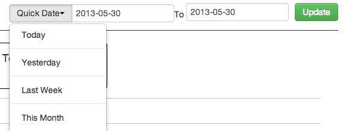

  <h3>Bluelink Date Picker Builder </h3>
	By David Holmes

	
  Create A Date Picker very easily with parameters 
  Also it comes with a quick date feature that helps you choose dates very easily without any javascript needed for the date picker
 <h3>Dependencies</h3>
  Jquery 
  Bootstrap 
  Bluelink.core.js

  <h3>Screen Shot</h3>
   

<h3>DIV Example </h3>

	

	

<h3>Javascript Example </h3>
	

	$('#myDiv').html(build_date_picker({
		onupdate:'reload_data',
		start_date:'2013-05-13',
		end_date:'2013-05-13'
	}))
	
<h3>Full HTML Example </h3>
	
	<link href="//netdna.bootstrapcdn.com/twitter-bootstrap/2.3.1/css/bootstrap-combined.min.css" rel="stylesheet">
	

	

	<!DOCTYPE html PUBLIC "-//W3C//DTD HTML 4.01 Transitional//EN">
	<html>
    <body>
	  

	

	

	
    	</body>
		</html>
